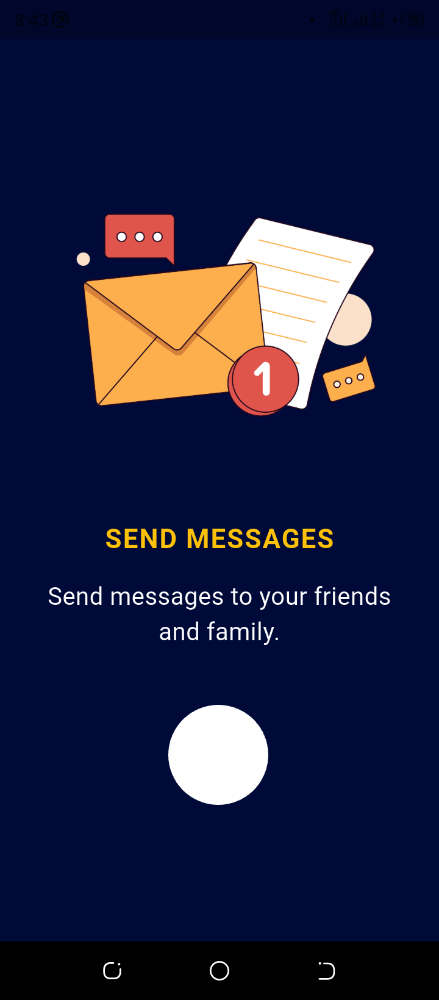
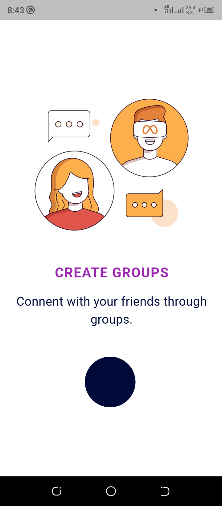
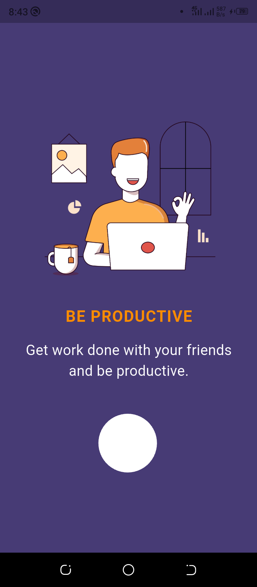
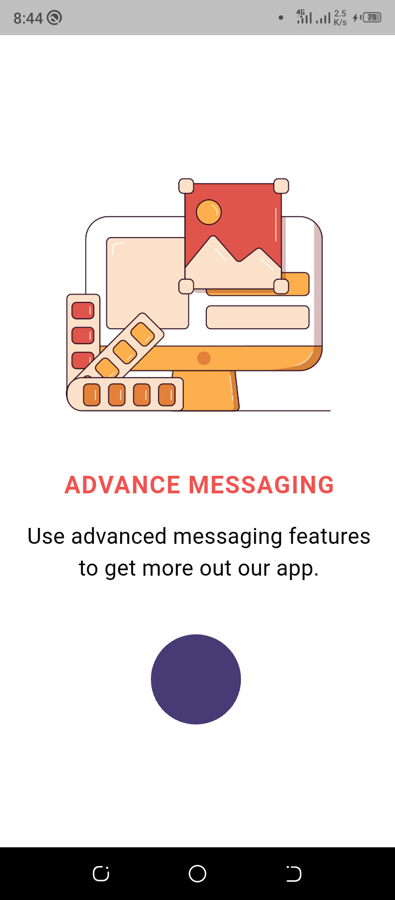

# Flutter Animated Onboarding

This is a simple flutter project that shows how the concentric transition package works. It emphasizes smooth animation through the different onboarding screens.

Below are the screenshots for the screens used in this project.

  
   
  
  

### How to use

1. Clone this repository into your local machine
2. Open your terminal and navigate to the root the clone repo
3. Run `flutter pub get` to install the required dependencies like the concentric transition package
4. You can run app on either an emulator/simulator or a real device to see how good it looks

**Note:** You can explore the concentric transition package and other flutter packages via [pub.dev](www.pub.dev)

Have a smooth experience with concentric transition.
